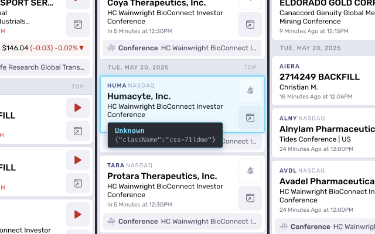

# React Component Finder

A Chrome extension that helps React developers quickly navigate between components in the browser and their source files in VS Code.



## Features

-   **Component Highlighting**: Hover over elements to see their React component boundaries
-   **Component Info**: View component names and props in a tooltip
-   **VS Code Integration**: Ctrl+Click (or Cmd+Click on Mac) to open the component source file directly in VS Code
-   **Developer Friendly**: Works with any locally hosted React app

## Requirements

-   Google Chrome browser
-   React DevTools extension installed
-   VS Code editor
-   React app running in development mode with source maps enabled

## Installation

### From Source (Development)

1. Clone this repository or download the source code:

    ```
    git clone https://github.com/yourusername/react-component-finder.git
    ```

2. Open Chrome and navigate to `chrome://extensions/`

3. Enable "Developer mode" using the toggle in the top-right corner

4. Click "Load unpacked" and select the directory containing the extension files

5. The extension should now appear in your Chrome toolbar

### Required Files

The extension consists of the following files:

-   `manifest.json` - Extension configuration
-   `background.js` - Background service worker
-   `content-script.js` - Content script that runs on the page
-   `inject-script.js` - Script that gets injected into the page to access React
-   `styles.css` - Styling for the component highlighting
-   `icon.png` - Extension icon (128x128px)

## Usage

1. Navigate to your locally running React app (e.g., http://localhost:3000)

2. Click the React Component Finder icon in your Chrome toolbar to activate the extension

3. When prompted, enter the absolute path to your React project's root directory:

    - For Mac: `/Users/yourusername/path/to/react-project`
    - For Windows: `C:\path\to\react-project`
    - For Linux: `/home/yourusername/path/to/react-project`

4. Once activated, hover over DOM elements to see which React components they belong to:

    - Blue highlight shows component boundaries
    - Tooltip shows component name and props

5. To open a component in VS Code:

    - Hold Ctrl key (or Cmd key on Mac)
    - Click on the highlighted component
    - VS Code should open with the correct source file

6. Click the extension icon again to deactivate when you're done

## How It Works

The extension uses Chrome's DevTools protocol to:

1. Inject a script into your React app
2. Access React's fiber tree through React DevTools hooks
3. Map DOM elements to their component definitions and source files
4. Use VS Code's URI protocol handler to open the correct file

The extension relies on React's debug information, which is available in development mode with source maps enabled.

## Troubleshooting

### Extension doesn't activate on my React app

-   Make sure your React app is running on localhost
-   Check that the extension is enabled in Chrome

### Component highlighting works but VS Code doesn't open

-   Verify that VS Code is installed and properly registered to handle `vscode://` URLs
-   Ensure you provided the correct absolute path to your React project
-   Check that your React app is running in development mode with source maps

### Can't find component source files

-   Make sure React DevTools extension is installed
-   Verify that your React app is using a development build
-   Check that your bundler is generating proper source maps
-   Some components might not have source mapping information (especially third-party components)

### Extension crashes or shows errors

-   Check Chrome's DevTools console for error messages
-   Try refreshing the page and reactivating the extension
-   Ensure your React version is compatible (works best with React 16.8+)

## License

MIT License

Copyright (c) 2025 Your Name

Permission is hereby granted, free of charge, to any person obtaining a copy
of this software and associated documentation files (the "Software"), to deal
in the Software without restriction, including without limitation the rights
to use, copy, modify, merge, publish, distribute, sublicense, and/or sell
copies of the Software, and to permit persons to whom the Software is
furnished to do so, subject to the following conditions:

The above copyright notice and this permission notice shall be included in all
copies or substantial portions of the Software.

THE SOFTWARE IS PROVIDED "AS IS", WITHOUT WARRANTY OF ANY KIND, EXPRESS OR
IMPLIED, INCLUDING BUT NOT LIMITED TO THE WARRANTIES OF MERCHANTABILITY,
FITNESS FOR A PARTICULAR PURPOSE AND NONINFRINGEMENT. IN NO EVENT SHALL THE
AUTHORS OR COPYRIGHT HOLDERS BE LIABLE FOR ANY CLAIM, DAMAGES OR OTHER
LIABILITY, WHETHER IN AN ACTION OF CONTRACT, TORT OR OTHERWISE, ARISING FROM,
OUT OF OR IN CONNECTION WITH THE SOFTWARE OR THE USE OR OTHER DEALINGS IN THE
SOFTWARE.

## Contributing

Contributions are welcome! Please feel free to submit a Pull Request.

1. Fork the repository
2. Create your feature branch (`git checkout -b feature/amazing-feature`)
3. Commit your changes (`git commit -m 'Add some amazing feature'`)
4. Push to the branch (`git push origin feature/amazing-feature`)
5. Open a Pull Request
